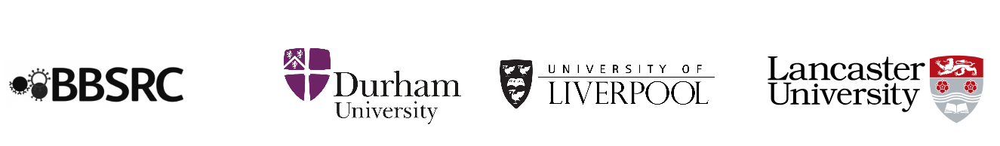

# Welcome to SAVSNET

The Small Animal Veterinary Surveillance Network (SAVSNET) is an initiative from the British Small Animal Veterinary Association and the University of Liverpool. Both share the same passion for companion animal welfare, education and science.

[www.liverpool.ac.uk/savsnet/](https://www.liverpool.ac.uk/savsnet/)

[@savsnet](https://twitter.com/savsnet)

## History
Following completion of the pilot phase of the project (2008-2011), SAVSNET Ltd. was formed as a joint venture between the British Small Animal Veterinary Association (BSAVA) and the University of Liverpool.  From October 2012 - November 2017, SAVSNET Ltd. was a registered charity (number 1149531).

In April 2016, SAVSNET was awarded £700k from the Biotechnology and Biological Sciences Research Council (BBSRC) to expand its database of UK pet health records and support more ‘big data’ research into animal and human diseases.

Previously a partnership between BSAVA and the University of Liverpool, the SAVSNET project is now solely run by the University.  SAVSNET Ltd was dissolved in November 2017.  To facilitate ongoing collaboration with BSAVA, SAVSNET now operates under a license agreement between the two parties.

## Research Priorities
SAVSNET harnesses electronic health and environmental data for rapid and actionable research and surveillance.  Our research priorities are currently:

* Antimicrobial use resistance: describing antimicrobial use and resistance at a local and national level to improve antimicrobial stewardship
* Climate and environment: linking health records with landscape, climate and soci-ecosystem data to predict risks in space and time. This work is currently focused on ectoparasites such as ticks.
* Infection and zoonosis: quantifying risk of infection in real-time across space and time to anticipate targeted health messages
These are cross-but by enabling expertise in:

* Epidemiolgy: using multiple methods from standard epidemiolgical approaches to advanced statistical models, to rapidly health threats and identify determinants of disease in order to deliver improved surveillance and inform disease prevention and treatment strategies.
* Biomedical text mining: knowledge discovery from large datasets of free text electronic health records and laboratory results to promote clinical and research initiatives.
* Pathogen and host-pathogen interaction: complete sequence and biological charaterisations of pathogens in clinically relevant timescales to describe microbial pathogenesis, evolution and transmission.

